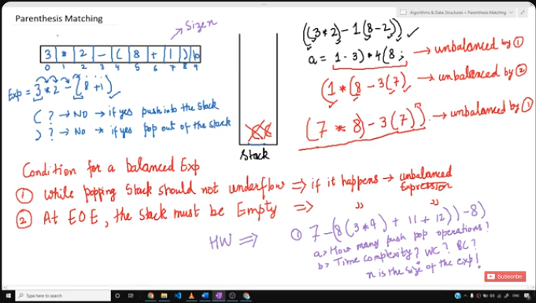

# PARANTHESIS MATCHING PROBLEM



## IMPLEMENTATION PLAN

- Input equation into an array
- Traverse array and `push`, `pop` as required
    - if element == '(':
        push into stack
    - if element == ')' && !isEmpty:
        pop from stack
    - else:
        return 0
- Finally, if stack empty after traversal -> ans = YES

## PSEUDOCODE

```c
int parenMatch(char *exp) {
    struct Stack *sp;

    for (int i = 0; exp[i] != '\0'; i++) {
        if (exp[i] == '(') {
            push(sp, exp[i]);
        }
        else if (exp[i] == ')') {
            if ( isEmpty(sp) ) {
                return 0;
            }
            pop(sp);
        }
    }
    
    if ( isEmpty(sp) ) {
        return 1;
    }

    return 0;
}
```

## FULL CODE

```c
#include <stdio.h>
#include <stdlib.h>

struct Stack {
    int size;
    int top;
    char *arr;
};

int isEmpty(struct Stack* ptr) {
    if (ptr->top == -1) {
        return 1;
    }
    else {
        return 0;
    }
}

int isFull(struct Stack* ptr) {
    if (ptr->top == ptr->size-1) {
        return 1;
    }
    else {
        return 0;
    }
}

void push(struct Stack* ptr, char data) {
    if (!isFull) {
        ptr->top++;
        ptr->arr[ptr->top] = data;
    }
    else {
        printf("Stack Overflow\n");
    }
}

char pop(struct Stack* ptr) {
    if (!isEmpty) {
        char val = ptr->arr[ptr->top];
        ptr->top = ptr->top-1;

        return val;
    }
    else {
        printf("Stack Empty/Underflow\n");
        return -1;
    }
}

int peek(struct Stack* ptr, int position) {
    //returns last element 'top-position-1' first because of LIFO

    if (ptr -> top-position-1 > 0) {
        return ptr->arr[ptr -> top-position+1];
    }
    else {
        printf("Position doesn't exist\n");
        return -1;
    }
}

int parenMatch(char *exp) {
    struct Stack *sp;
    sp->size = 100;
    sp->top = -1;
    sp->arr = (char *) malloc(s1->size * sizeof(char));

    for (int i = 0; exp[i] != '\0'; i++) {
        if (exp[i] == '(') {
            push(sp, exp[i]);
        }
        else if (exp[i] == ')') {
            if ( isEmpty(sp) ) {
                return 0;
            }
            pop(sp);
        }
    }
    
    if ( isEmpty(sp) ) {
        return 1;
    }

    return 0;
}

int main() {
    char *exp = "8*(-78))";

    ( parenMatch(exp) )?printf("MATCHED\n"):printf("NOT MATCHED\n");
}
```
