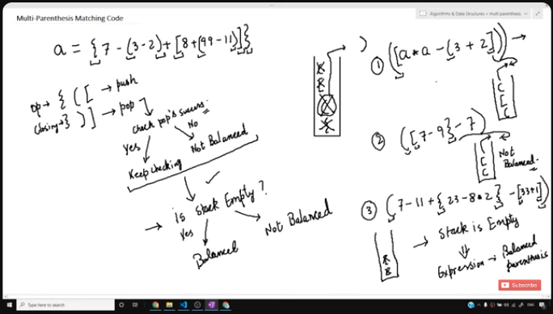

# MULTIPLE PARENTHESIS MATCHING



## IMPLEMENTATION PLAN

- Brackets: `(`, `[`, `{`.
- if (opening bracket):
    - push(element);
- else if (closing bracket):
    - if ( !isEmpty ) {
        - if ( !(opening bracket == top's closing bracket) ) {
            - return 0;
        - }
        - pop();
    - }
    - return 0;
- Finally, if stack empty after traversal -> ans = YES

## FULL CODE

```c
#include <stdio.h>
#include <stdlib.h>

struct Stack {
    int size;
    int top;
    char *arr;
};

int isEmpty(struct Stack* ptr) {
    if (ptr->top == -1) {
        return 1;
    }
    else {
        return 0;
    }
}

int isFull(struct Stack* ptr) {
    if (ptr->top == ptr->size-1) {
        return 1;
    }
    else {
        return 0;
    }
}

void push(struct Stack* ptr, char data) {
    if (!isFull) {
        ptr->top++;
        ptr->arr[ptr->top] = data;
    }
    else {
        printf("Stack Overflow\n");
    }
}

char pop(struct Stack* ptr) {
    if (!isEmpty) {
        char val = ptr->arr[ptr->top];
        ptr->top = ptr->top-1;

        return val;
    }
    else {
        printf("Stack Empty/Underflow\n");
        return -1;
    }
}

int peek(struct Stack* ptr, int position) {
    //returns last element 'top-position-1' first because of LIFO

    if (ptr -> top-position-1 > 0) {
        return ptr->arr[ptr -> top-position+1];
    }
    else {
        printf("Position doesn't exist\n");
        return -1;
    }
}

char stackTop(struct stack *sp) {
    return sp->arr[sp->top];
}

int match(char a, char b) {
    if (a=='(' && b==')') {
        return 1;
    }
    if (a=='[' && b==']') {
        return 1;
    }
    if (a=='{' && b=='}') {
        return 1;
    }

    return 0;
}

int parenMatch(char *exp) {
    struct Stack *sp;
    sp->size = 100;
    sp->top = -1;
    sp->arr = (char *) malloc(s1->size * sizeof(char));

    char popped_ch;

    for (int i = 0; exp[i] != '\0'; i++) {
        if (exp[i] == '(' || exp[i] == '[' || exp[i] == '{') {
            push(sp, exp[i]);
        }
        else if (exp[i] == '}' || exp[i] == '}' || exp[i] == '}') {
            if ( isEmpty(sp) ) {
                return 0;
            }

            popped_ch = pop(sp);
            if ( !match(popped_ch, exp[i]) ) {
                return 0;
            }
        }
    }
    
    if ( isEmpty(sp) ) {
        return 1;
    }

    return 0;
}

int main() {
    char *exp = "8*(-78))";

    ( parenMatch(exp) )?printf("MATCHED\n"):printf("NOT MATCHED\n");
}
```
