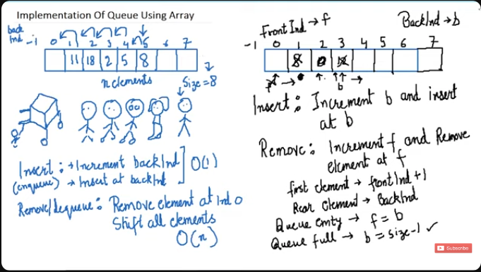

## IMPLEMENTATION PLAN



Insert: Increment `Rear` and insert at `Rear`.
Remove: Increment `Front` and remove from `Front`.

First Element: `Front + 1`
Last Element: `Rear`

Queue Empty: `Front == Rear`
Queue Full: `Rear = Size - 1`

## FULL CODE

```c
#include <stdio.h>
#include <stdlib.h>

struct Queue {
    int size;
    int front;
    int rear;
    int *arr;
};

int isFull(struct Queue *q) {
    if (q->rear == q->size-1) {
        return 1;
    }

    return 0;
}

int isEmpty(struct Queue *q) {
    if (q->front == q->rear) {
        return 1;
    }

    return 0;
}

void enqueue(struct Queue *q, int val) {
    if ( !isFull(q) ) {
            q->rear = q->rear + 1;
            q->arr[q->rear] = val;
    }
    else {
        printf("Queue Overflow");
    }
}

void dequeue(struct Queue *q) {
    if ( !isEmpty(q) ) {
            q->front++;
            return q->arr[q->front];
    }
    else {
        printf("Queue Underflow");
    }
}

int main() {
    struct Queue q;
    q.size = 10;
    q.front = -1;
    q.rear = -1;
    q.arr = (int *) malloc(q.size * sizeof(int));

    enqueue(&q, 12);
    enqueue(&q, 15);

    printf(dequeue(&q));

    return 0; 
}
```
