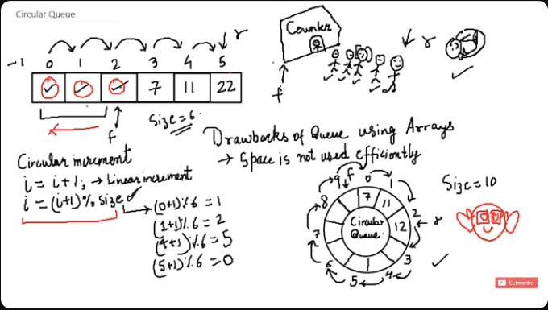

# CIRCULAR QUEUE



Main Condition: `(i+1) % size`

## FULL CODE

```c
#include <stdio.h>
#include <stdlib.h>

struct Queue {
    int size;
    int front;
    int rear;
    int *arr;
};

int isFull(struct Queue *q) {
    if ( (q->r+1)%q->size == q->f )) {
        return 1;
    }

    return 0;
}

int isEmpty(struct Queue *q) {
    if (q->front == q->rear) {
        return 1;
    }

    return 0;
}

void enqueue(struct Queue *q, int val) {
    if( (q->r+1)%q->size == q->f ) {
        printf("Queue Overflow");
    }
    else {
        q->r = (q->r+1)%q->size;
        q->arr[q->r] = val;
    }
}

int dequeue(struct Queue *q) {
    if( q->r == q->f ) {
        printf("Queue Underflow");
    }
    else {
        q->f = (q->f+1)%q->size;
    }

    return q->arr[a->f];
}

int main() {
    struct Queue q;
    q.size = 10;
    q.front = 0;
    q.rear = 0;
    q.arr = (int *) malloc(q.size * sizeof(int));

    enqueue(&q, 12);
    enqueue(&q, 15);

    printf(dequeue(&q));

    return 0; 
}
```

